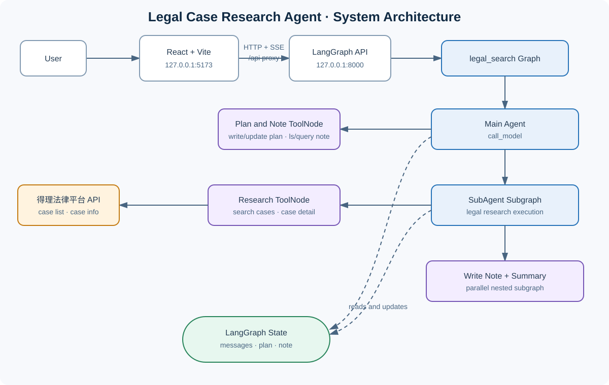

# Legal Case Research Agent

`legal-case-research-agent` 是一个面向中国裁判案例检索与类案研究的 LangGraph 应用。用户提交法律研究问题后，主 Agent 负责制定计划、逐项委派和跟踪任务；SubAgent 使用真实法律案例 API 检索及分析裁判文书，将研究笔记写入 Graph State；React 前端通过 LangGraph 本地 API 的 SSE 流展示计划、对话、案例和笔记。

当前代码是本文档的事实来源。本项目不会在浏览器中模拟 Agent、案例或研究结论。

## Attribution

本项目基于 `tbice` 的开源项目修改和扩展。原项目采用 MIT License；本仓库保留原始 MIT License 及 `Copyright (c) 2025 tbice` 版权声明。

从当前代码能够确认的二次开发内容包括：将原有场景改造为中国法律案例研究；接入得理法律平台的案例列表与案例详情 API；为昂贵法律检索增加按子任务计数和去重约束；调整 SubAgent 的研究、笔记写入与摘要流程；以及增加独立的 React/Vite 法律研究工作台。

## Key Features

- Main Agent 使用 `write_plan` / `update_plan` 管理真实研究计划，并通过 `transfor_task_to_subagent` 路由到 SubAgent。
- SubAgent 可查询既有笔记、检索中国裁判案例、获取具体裁判文书详情并保存研究笔记。
- 每个子任务最多调用一次 `search_legal_cases`，最多获取 3 个不同 `case_id` 的详情，并阻止重复详情调用。
- Graph State 保存消息、计划、笔记、子任务消息以及法律 API 调用计数。
- React 前端创建 LangGraph thread，消费 `values` / `updates` SSE 事件，并支持取消当前 run。
- 前端展示来自后端 State 或工具消息的计划、最终对话、案例资料与研究笔记。

## System Architecture



可编辑的 Mermaid 源文件：[`assets/system-architecture.mmd`](./assets/system-architecture.mmd)。

浏览器只与 LangGraph API 通信。模型密钥和 `DELI_API_KEY` 由后端环境读取，不应进入前端代码或浏览器存储。

## Agent Workflow


可编辑的 Mermaid 源文件：[`assets/agent-workflow.mmd`](./assets/agent-workflow.mmd)。

主图没有静态 conditional edge；路由由 `call_model` 返回的 LangGraph `Command(goto=...)` 决定。普通主 Agent 工具执行后回到 `call_model`，SubAgent 完成后也回到 `call_model`，因此主 Agent 可以更新计划、继续委派下一项任务或直接生成最终回答。

SubAgent 同样通过 `Command` 动态路由。研究工具执行后回到 `subagent_call_model`；请求 `write_note` 时进入并行的写笔记/摘要子图，随后结束当前 SubAgent 调用。摘要作为与主 Agent 委派 tool call 对应的 `ToolMessage` 写入主消息流。

主要状态包括：

- `messages`：用户、主 Agent、工具摘要等主图消息。
- `plan`：由 `PlanStateMixin` 提供的计划项及 `pending`、`in_progress`、`done` 状态。
- `note`：由 `NoteStateMixin` 提供的状态内笔记映射，不是磁盘文件系统。
- `task_messages`：累计保存 SubAgent 未经笔记流程直接结束时回传的任务消息。
- `temp_task_messages`：SubAgent 工具交互使用的消息通道。
- `legal_search_count`、`case_detail_count`、`case_detail_ids`：法律 API 调用限制与去重状态。

## Project Structure

```text
.
├── src/
│   └── agent/
│       ├── graph.py                 # 主 LangGraph 构建函数
│       ├── node.py                  # Main Agent 节点与主工具节点
│       ├── state.py                 # 主图输入与状态
│       ├── tools.py                 # 计划、笔记、案例检索工具
│       ├── prompts/prompt.py        # Main/SubAgent/摘要提示词
│       ├── utils/context.py         # 模型和提示词运行时配置
│       └── sub_agent/               # SubAgent 子图、状态与摘要子图
├── frontend/
│   ├── src/api/                     # LangGraph API、SSE 解析和 State 映射
│   ├── src/components/              # 计划、对话、案例与输入组件
│   └── vite.config.ts               # 开发端口和后端代理
├── langgraph.json                   # legal_search Graph 注册
├── pyproject.toml                   # Python 版本与后端依赖
├── .env.example                     # 后端环境变量模板
└── LICENSE                          # 原项目 MIT License
```

## Backend

后端使用 Python 3.12、LangChain 和 LangGraph。`langgraph.json` 将 assistant/graph 标识 `legal_search` 注册到 `src.agent.graph:build_graph`。本地 LangGraph API 提供 thread、run stream、state 和 run cancellation 等接口；前端实际使用：

- `POST /threads`
- `POST /threads/{thread_id}/runs/stream`
- `GET /threads/{thread_id}/state`
- `POST /threads/{thread_id}/runs/{run_id}/cancel?action=interrupt`

流式请求使用 `stream_mode: ["values", "updates"]`、`stream_subgraphs: true` 和 `multitask_strategy: "reject"`。前端以 `values` 事件作为权威 UI State；不会把 `updates` 事件伪造成可见回复。

## Frontend

前端是独立的 React、TypeScript 和 Vite 应用，开发地址为 `http://127.0.0.1:5173`。Vite 默认把 `/api` 代理到 `http://127.0.0.1:8000`；也可用 `VITE_LANGGRAPH_API_BASE_URL` 指定 API 基址。

当前界面包含研究计划、对话/最终结论、案例与研究笔记三个区域，并显示 run 状态、错误和 SSE 心跳状态。首次提交时创建 thread；同一页面的后续提交复用该 thread。运行期间禁用重复提交，并可在取得 `run_id` 后请求取消。

## Tools / Integrations

### Main Agent tools

- `write_plan`：创建研究计划。
- `update_plan`：更新计划项状态。
- `transfor_task_to_subagent`：作为委派信号，将当前任务路由到 SubAgent（函数名按现有代码保留）。
- `ls` / `query_note`：列出和读取 State 中的研究笔记。

### SubAgent tools

- `query_note`：读取已有研究资料。
- `search_legal_cases`：调用得理法律平台案例列表 API。
- `get_case_detail`：按 `case_id` 调用得理法律平台案例详情 API。
- `write_note`：通过专用写入节点保存研究结果。

`tools.py` 仍定义了 `tavily_search` 和 `update_note`，但当前 Main Agent 与 SubAgent 的绑定工具列表均未启用它们，因此它们不属于当前执行路径。

## Setup

### Requirements

- Python 3.12（见 `.python-version` 和 `pyproject.toml`）
- [uv](https://docs.astral.sh/uv/)
- Node.js 与 npm（前端 `package.json` 未声明具体 Node 版本）
- 可用的模型提供商密钥，以及使用法律检索时所需的得理法律平台密钥

### Backend

```bash
uv sync
```

复制环境变量模板：

```bash
cp .env.example .env
```

Windows PowerShell 可使用：

```powershell
Copy-Item .env.example .env
```

启动 LangGraph 本地 API：

```bash
uv run langgraph dev --host 127.0.0.1 --port 8000 --allow-blocking --no-browser
```

Windows PowerShell 也可以直接运行项目提供的启动脚本：

```powershell
.\start-backend.ps1
```

两种方式都使用 `--no-browser`，因此启动后端时不会自动打开 LangSmith Studio。CLI 仍可能在终端打印 Studio URL，这只是提示信息，不会触发浏览器弹窗。

API 文档位于 `http://127.0.0.1:8000/docs`。

### Frontend

```bash
cd frontend
npm install
npm run dev
```

打开 `http://127.0.0.1:5173`。开发代理会把 `/api` 请求转发到本地后端。

## Environment Variables

根据当前默认模型配置和工具代码，后端需要：

```env
MOONSHOT_API_KEY=
DEEPSEEK_API_KEY=
DASHSCOPE_API_KEY=
DASHSCOPE_API_BASE=
DELI_API_KEY=
```

切换到已注册的其他模型提供商时可能还需要：

```env
ZAI_API_KEY=
SILICONFLOW_API_KEY=
SILICONFLOW_API_BASE=
```

前端可选配置：

```env
VITE_LANGGRAPH_API_BASE_URL=
```

项目根目录 `.env` 已被 `.gitignore` 忽略。不要提交真实密钥，也不要把后端密钥放入 `VITE_` 变量；Vite 的此类变量会暴露给浏览器。

## Additional Documentation

- [`编写思路.md`](./编写思路.md)：基于当前代码的 Graph、Agent、状态与调用约束说明。
- [`不同产商模型的接入方式.md`](./不同产商模型的接入方式.md)：当前模型提供商注册和模型切换说明。

## License

本项目保留原项目的 MIT License 和原作者版权声明：`Copyright (c) 2025 tbice`。完整条款见 [`LICENSE`](./LICENSE)。
