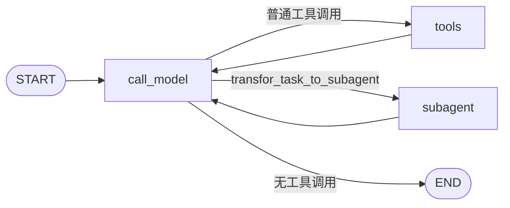
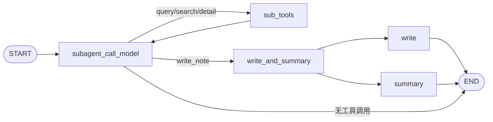

# Legal Case Research Agent：技术架构与实现说明

本文补充说明 `legal-case-research-agent` 当前代码中的 LangGraph 编排、Agent 职责和状态设计。面向使用者的安装与运行说明以 [`README.md`](./README.md) 为准。

## 1. 项目来源与范围

本项目基于 `tbice` 的开源项目二次开发，保留原项目 MIT License 和版权声明。当前代码将应用场景调整为中国法律案例研究，接入得理法律平台案例 API，增加法律工具调用约束，并提供独立 React/Vite 前端。

本文只描述现有执行路径，不把已定义但未绑定的工具或历史注释视为当前功能。

## 2. 主图编排

主图由 `src/agent/graph.py:build_graph` 构建，注册名为 `legal_search`。



主图节点：

- `call_model`：Main Agent。加载 `Context.plan_model`，绑定计划、委派和笔记读取工具。
- `tools`：`ToolNode`，实际执行 `write_plan`、`update_plan`、`ls`、`query_note`。
- `subagent`：编译后的 SubAgent 子图。

静态 edge 负责 `START → call_model`、`tools → call_model` 和 `subagent → call_model`。`call_model` 解析模型的第一个 tool call，并通过 `Command(goto=...)` 动态选择 `tools`、`subagent` 或 `END`。主模型绑定 `parallel_tool_calls=False`，因此主图按一次一个工具调用处理。

`transfor_task_to_subagent` 是路由信号：Main Agent 选择它时并不经过主 `ToolNode` 执行，而是把 AI tool-call 消息写入 `messages` 后直接进入 SubAgent。

## 3. SubAgent 子图



`subagent_call_model` 从 Main Agent 的委派 tool call 读取任务内容，结合首条用户需求、已有笔记文件名和 `temp_task_messages` 调用 `Context.sub_model`。

路由行为：

- `query_note`、`search_legal_cases`、`get_case_detail` 进入 `sub_tools`，执行后回到 SubAgent 模型继续研究。
- `write_note` 进入 `write_and_summary` 子图。该子图从 `START` 并行触发 `write` 与 `summary`：前者执行笔记写入，后者用 `Context.summary_model` 生成与 Main Agent 委派 tool call 对应的 `ToolMessage`。两条分支结束后，当前 SubAgent 调用结束。
- 如果模型不再调用工具，SubAgent 直接结束，并把临时研究消息与最终响应追加到 `task_messages`。

SubAgent 结束后，主图的静态 edge 返回 `call_model`。Main Agent 随后可更新计划、委派下一项任务或输出最终回答。

## 4. Agent 与工具职责

### Main Agent

- 理解用户研究要求。
- 创建和更新研究计划。
- 将具体任务委派给 SubAgent。
- 按需列出或查询研究笔记。
- 根据当前消息和计划继续调度，或生成最终回答。

Main Agent 当前不绑定法律案例检索工具，因此详细法律检索由 SubAgent 完成。

### SubAgent

- 执行一个被委派的具体研究任务。
- 按需查询之前保存的笔记。
- 检索中国法院案例并获取高价值案例详情。
- 分析研究材料并通过 `write_note` 保存结果。

### 工具层

当前主图工具：`write_plan`、`update_plan`、`ls`、`query_note`。

当前 SubAgent 研究工具：`query_note`、`search_legal_cases`、`get_case_detail`；`write_note` 由专门的写入节点执行。

`update_note` 和 `tavily_search` 虽在 `src/agent/tools.py` 中定义，但未绑定到当前 Agent/ToolNode，因而不在当前 Graph 执行路径内。

## 5. 状态设计

### 主状态

```python
class StateInput(MessagesState):
    pass

class State(MessagesState, PlanStateMixin, NoteStateMixin, total=False):
    task_messages: Annotated[list[AnyMessage], add_messages]
```

- `messages`：主图消息通道。
- `plan`：`PlanStateMixin` 提供的计划状态。
- `note`：`NoteStateMixin` 提供的笔记映射，是 Graph State 中的抽象存储，不是磁盘目录。
- `task_messages`：带 `add_messages` reducer 的子任务消息集合。

### SubAgent 状态

```python
class SubAgentState(State):
    temp_task_messages: Annotated[list[AnyMessage], add_messages]
    legal_search_count: int
    case_detail_count: int
    case_detail_ids: list[str]
```

- `temp_task_messages`：SubAgent 模型与研究 ToolNode 使用的消息通道。
- `legal_search_count`：记录当前状态中的案例检索次数。
- `case_detail_count`：记录案例详情调用次数。
- `case_detail_ids`：记录已请求详情的案例 ID，用于去重。

代码没有显式清空上述 SubAgent 字段；它们在嵌入式子图调用之间的具体生命周期受 LangGraph 子图 State 合并语义影响。因此不应仅凭字段名称宣称每次委派都会创建全新、完全隔离的状态。

## 6. 法律 API 调用约束

`subagent_call_model` 在进入 ToolNode 前执行约束：

- `search_legal_cases`：计数达到 1 后拒绝再次执行，并向模型加入说明消息。
- `get_case_detail`：必须提供 `case_id`；相同 ID 不得重复；累计最多 3 个不同 ID。
- 被拒绝的调用返回 `subagent_call_model`，让模型基于已有材料继续研究。

`search_legal_cases` 请求得理法律平台案例列表并返回精简后的案例元数据；`get_case_detail` 请求单案详情，并优先返回结构化文书内容。API 凭据只从后端环境变量 `DELI_API_KEY` 读取。

## 7. 前后端数据流

```text
Browser
  → POST /threads
  → POST /threads/{thread_id}/runs/stream
  ← metadata / values / updates / heartbeat / error
  → GET /threads/{thread_id}/state
```

前端使用 `values` 事件更新权威状态，流结束后再次读取 thread state。计划直接来自 `state.plan`，笔记来自 `state.note`，对话来自 `state.messages`。案例面板递归解析 `messages` 与 `temp_task_messages` 中的结构化工具结果，不使用硬编码案例。

运行期间 UI 阻止重复提交；请求设置 `multitask_strategy: "reject"`。取得 metadata 中的 `run_id` 后，用户可调用取消接口并中止本地流读取。

## 8. 已知实现边界

- Graph 注册名仍为 `legal_search`，这是当前前后端契约的一部分，没有仅为命名风格而改动。
- `transfor_task_to_subagent` 的拼写属于现有工具契约，本次文档审查不重命名它。
- `tavily_search` 与相关依赖仍保留在代码中，但当前未启用。
- 前端案例提取依赖工具结果仍出现在 State 消息中；若 LangGraph 的流式 State 投影或消息序列化格式变化，映射逻辑需要同步验证。
